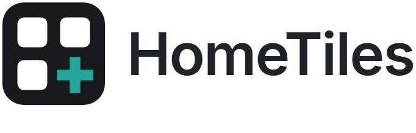
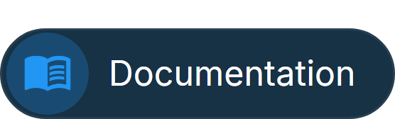
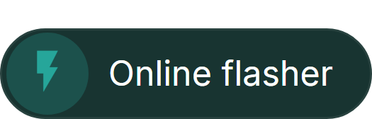
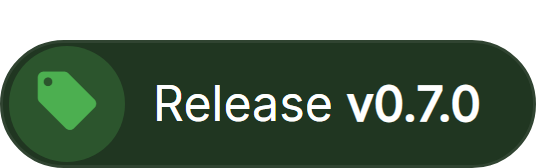
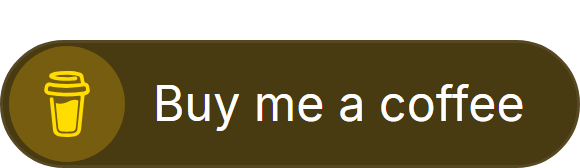
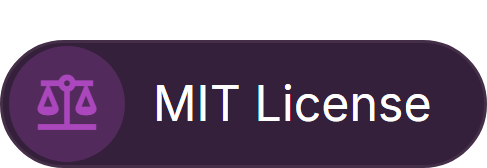
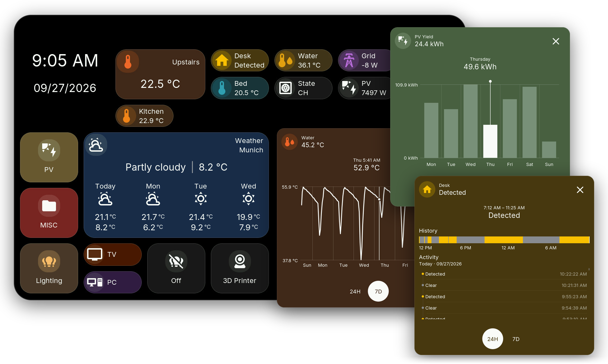

<picture>
  <source media="(prefers-color-scheme: dark)" srcset="docs/images/readme-brand-dark.png">
  
</picture>

Touch dashboards for Home Assistant on ESP32 displays. 
Lights, climate, sensors, energy, weather and more on a 4 to 10.1 inch touch screen.

 
 
Tap a tile for its popup, then slide through the history of sensors, energy and binary sensors.

## New in v0.8.0

- **[Lock, Alarm Panel and Fan tiles](https://galusperes.github.io/tiles/#fan):** with their own popups and code entry.
- **[Web Admin password](https://galusperes.github.io/web-admin/#web-admin-password)** and **[encrypted commands](https://galusperes.github.io/bridge/#encrypted-commands):** pair the display with Home Assistant by comparing a six-digit number.
- **[Redesigned Switch tile](https://galusperes.github.io/tiles/#switch):** a dimmer or switch bar across the tile, also for Cover and Climate, and half height for almost every tile.
- **[French and Polish](https://galusperes.github.io/device-ui/#localization):** two new languages, with their letters on the keyboard.
- **New boards:** Guition JC8012P4A1 V3 and Waveshare 7B with ESP32-P4 v3.x.

Before updating, update HomeTiles Bridge to **v0.8.0** and [export your dashboard](https://galusperes.github.io/updating/). [All changes](docs/releases/v0.8.0.md)

## Get started

You need a compatible display, Home Assistant, an MQTT broker and [HomeTiles Bridge](https://github.com/GalusPeres/HomeTiles-Bridge).

1. Find your exact model in the [device list](https://galusperes.github.io/#device-support).
2. Install it with the [online flasher](https://galusperes.github.io/installer/).
3. Connect [Home Assistant](https://galusperes.github.io/home-assistant-setup/) and [build your dashboard](https://galusperes.github.io/web-admin/) in the browser.

Camera tiles are experimental and available on ESP32-P4 only.

## Help

[Firmware updates](https://galusperes.github.io/updating/) · [Troubleshooting](https://galusperes.github.io/faq/) · [Report a problem](https://github.com/GalusPeres/HomeTiles/issues) · [Contribute](CONTRIBUTING.md) · [Architecture](ARCHITECTURE.md)

HomeTiles is free and open source under the [MIT License](LICENSE).
