# On-Device UI

Tap tiles to control devices, open folders, or view details. Configure the layout in the [Web Admin](web-admin.md).

<figure class="ht-screenshot">

<figcaption>HomeTiles dashboard</figcaption>
</figure>

Folders have their own grid. The back tile returns to the previous page.

<figure class="ht-screenshot">
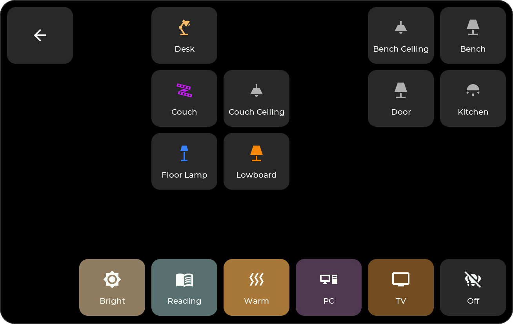
<figcaption>Folder with light tiles and scenes</figcaption>
</figure>

## Popups

For tiles with detail controls, choose a tap or long press as the popup trigger in the Web Admin.

Home Assistant can also open a folder or popup using the display's [View Select entity](bridge.md#control-the-displayed-view).

### Number, Select, and Date/Time

Editable controls sit above their history. Number uses a slider, a Climate-style temperature stepper, or a roller; Select uses the Settings dropdown; Date/Time uses swipeable time values and date step controls. See the [editable tile reference](tiles.md#number) for supported entities and input modes.

Number shows a graph and Activity; Select uses a compact timeline and gives the remaining space to Activity. Date/Time shows Activity below its taller controls. **24H / 7D** changes the requested period while keeping the previous data visible until the reply arrives.

Slider edits are sent on release. Step and time edits are grouped after a short pause. A slow HA device can take time to confirm the new value; the display keeps your edit while it waits. Control backgrounds follow the tile color.

### Light Control

Switch tiles assigned to a `light` entity open brightness, color, and color-temperature controls. The bottom icons switch views; the power button toggles the light. Only supported controls appear.

<figure class="ht-screenshot">
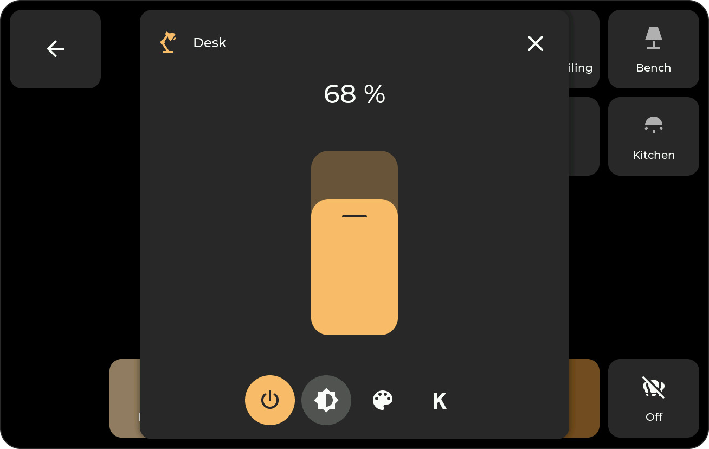
<figcaption>Light brightness control</figcaption>
</figure>
<figure class="ht-screenshot">
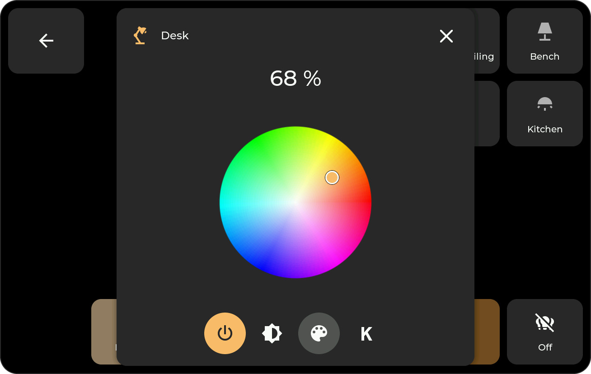
<figcaption>Light color control</figcaption>
</figure>
<figure class="ht-screenshot">
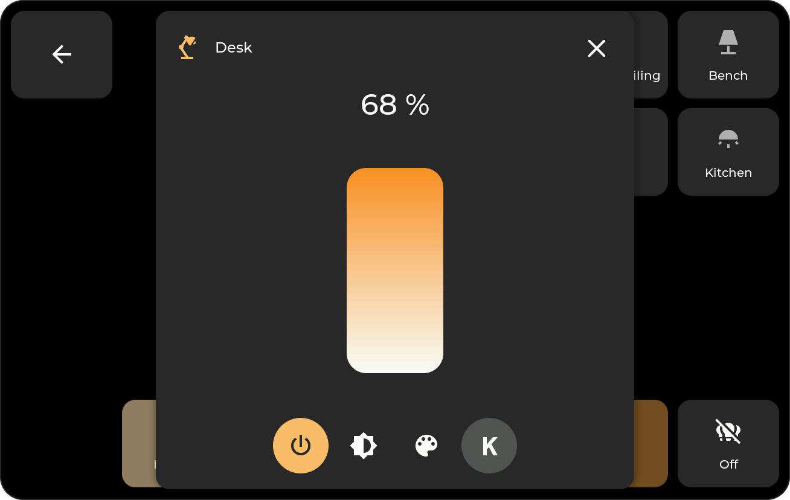
<figcaption>Light color temperature control</figcaption>
</figure>

### Cover Control

Use separate position and tilt sliders, or switch to open, close, and stop buttons. Controls depend on the cover's capabilities and availability.

### Sensor And Binary Sensor History { data-toc-label="Sensor history" }

Choose a **24-hour** or **7-day** view. Numeric sensors show a graph; binary and text-valued sensors show a state timeline and scrollable Activity list.

<figure class="ht-screenshot">
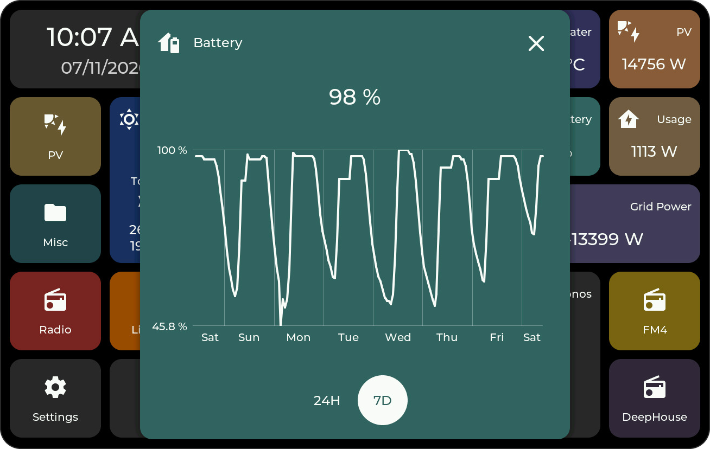
<figcaption>Sensor history over seven days</figcaption>
</figure>

### Energy Statistics

Energy popups show hourly bars for the day and daily bars for the week.

<figure class="ht-screenshot">
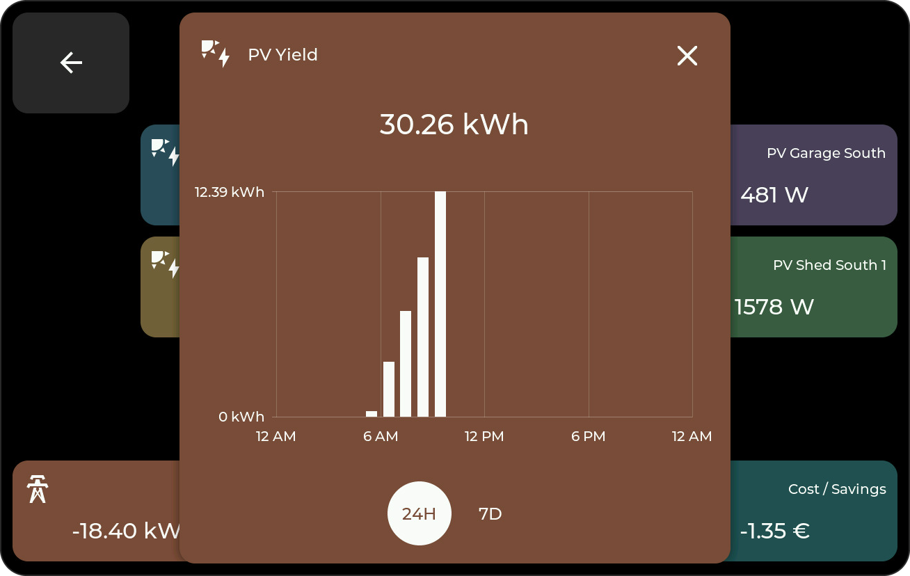
<figcaption>Energy statistics over 24 hours</figcaption>
</figure>
<figure class="ht-screenshot">
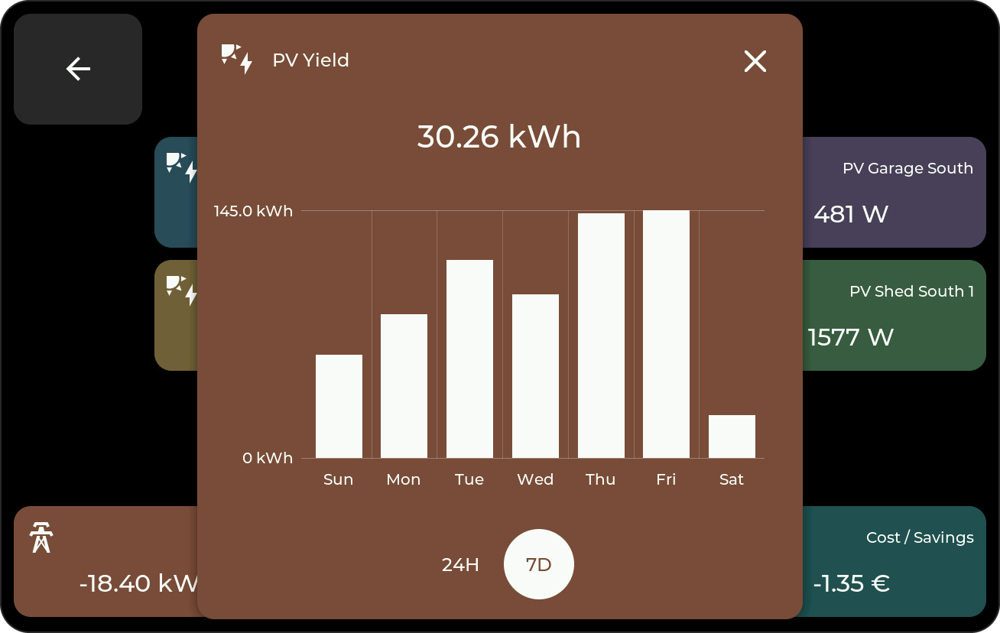
<figcaption>Energy statistics over seven days</figcaption>
</figure>

### Weather

View temperatures, precipitation, and rain probability. Use the arrows to browse the available forecast.

<figure class="ht-screenshot">
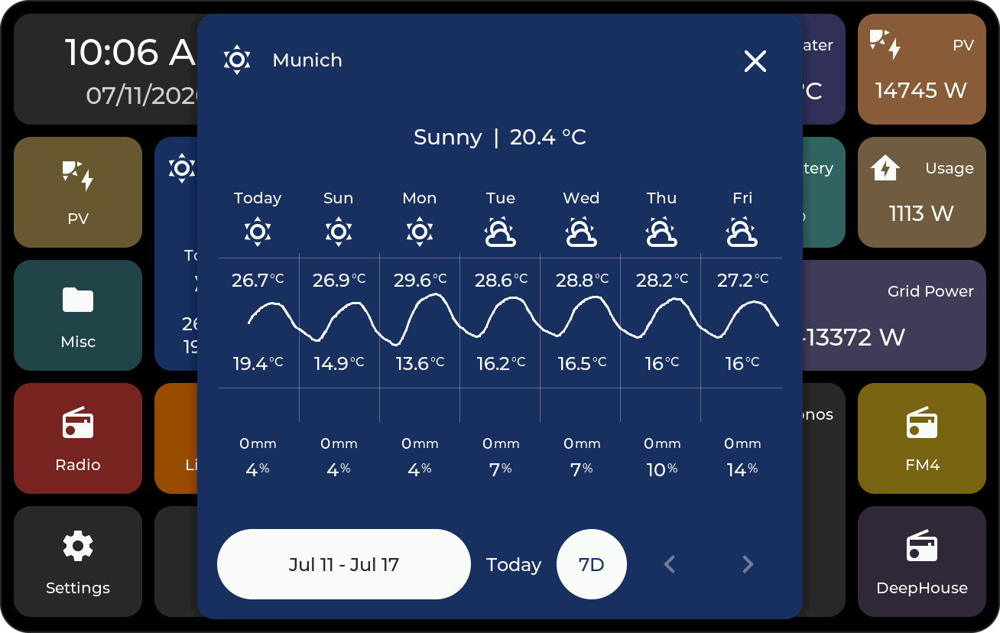
<figcaption>Weather forecast</figcaption>
</figure>

### Media

The popup adds playback controls and a volume slider to the title and cover art.

<figure class="ht-screenshot">
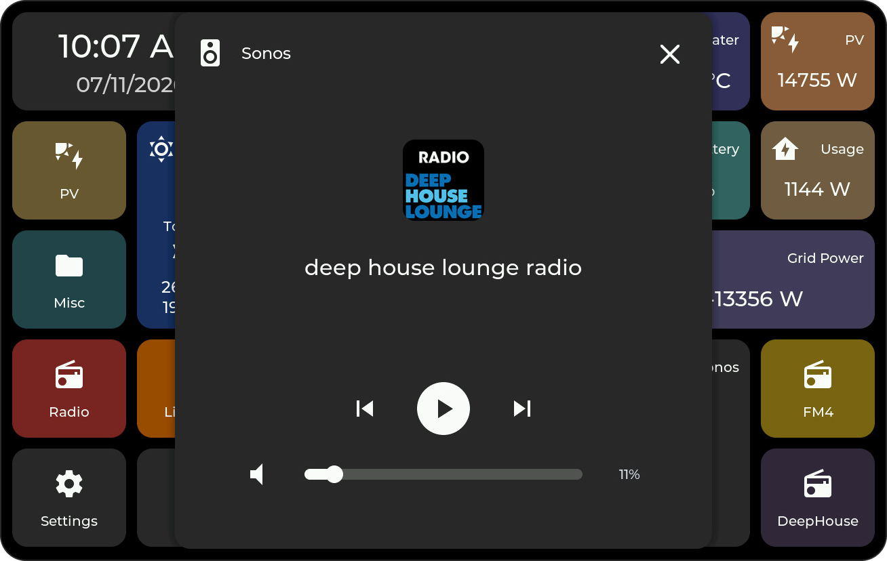
<figcaption>Media playback controls</figcaption>
</figure>

### Climate

Adjust the target temperature with the dial or plus/minus buttons. Available controls may include heating/cooling targets, humidity, mode, presets, fan, and swing. Scroll longer option lists.

These examples show a full air-conditioner control set and a simpler heating-only entity:

<figure class="ht-screenshot">

<figcaption>Climate popup with all supported controls</figcaption>
</figure>
<figure class="ht-screenshot">

<figcaption>Heat-only Climate popup</figcaption>
</figure>

### Camera (experimental) { data-toc-label="Camera" }

Camera tiles open a 16:9 video popup on ESP32-P4. See [Camera tiles](tiles.md#camera-experimental) for setup and requirements.

## Settings

The gear tile opens Settings.

<figure class="ht-screenshot">
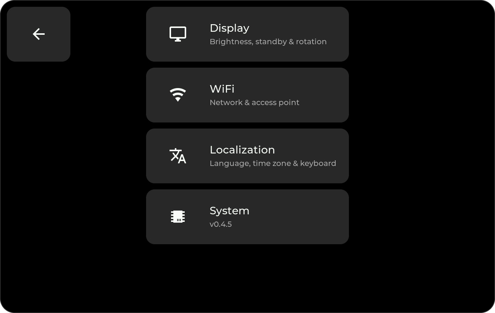
<figcaption>Device settings menu</figcaption>
</figure>

If Settings is PIN-protected, enter the PIN to open it. If hidden, swipe inward from the configured edge. The recovery PIN **466384537** also unlocks protected folders; see [access control](web-admin.md#device-settings).

### Display

Adjust brightness, sleep timeout, screensaver timeout, and screensaver brightness. **Never** disables the corresponding timeout. The rotate button turns the UI by 180°.

<figure class="ht-screenshot">

<figcaption>Display and screensaver settings</figcaption>
</figure>

Tap a **Clock** tile to open the screensaver immediately. See [Screensaver](screensaver.md) for its layout and images.

### WiFi

Select a network and enter its password. The connected network is checked, and its IP address opens the [Web Admin](web-admin.md).

<figure class="ht-screenshot">
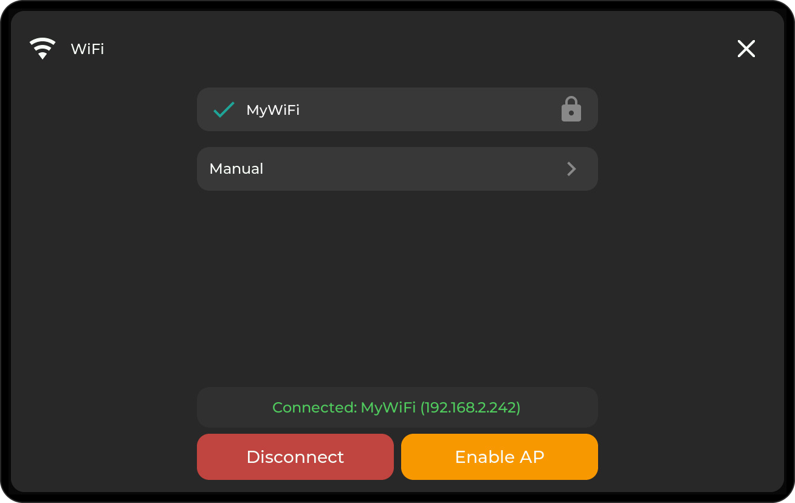
<figcaption>WiFi settings</figcaption>
</figure>

- **Disconnect:** stay offline until you reconnect or restart; saved credentials remain.
- **Enable AP:** connect through the display's hotspot and setup portal.
- **Manual:** enter the SSID and password with the on-screen keyboard.

<figure class="ht-screenshot">
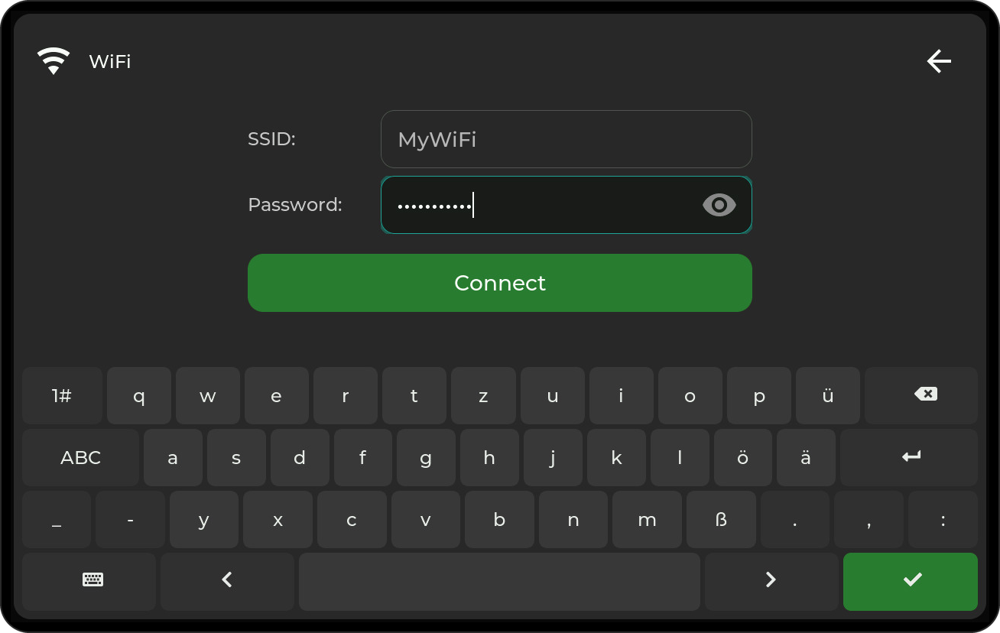
<figcaption>WiFi entry with the on-screen keyboard</figcaption>
</figure>

### Localization

Choose English or German, time zone, date/time formats, and keyboard layout. Tile titles also support Cyrillic characters.

<figure class="ht-screenshot">
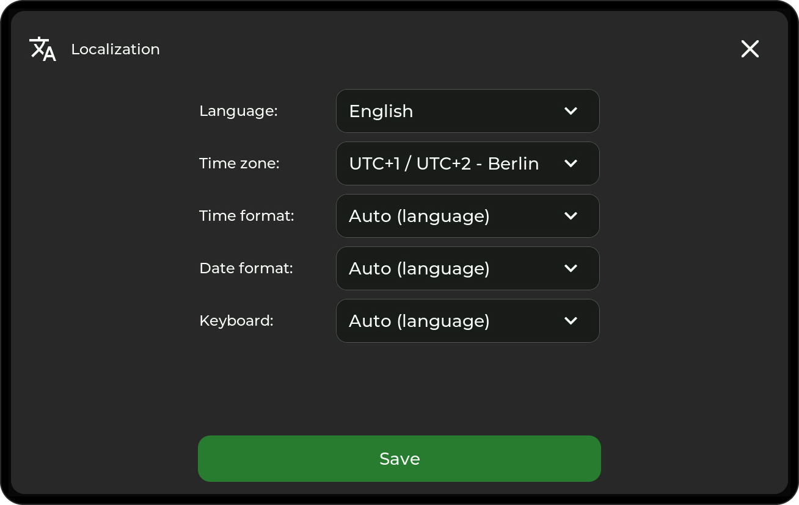
<figcaption>Language and regional settings</figcaption>
</figure>
<figure class="ht-screenshot">
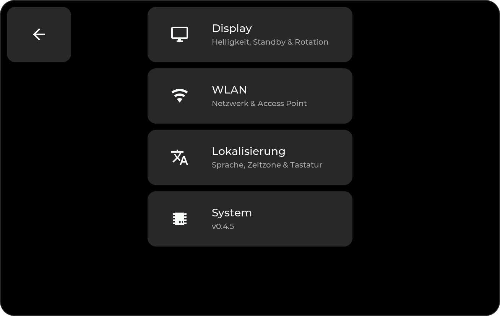
<figcaption>Device settings in German</figcaption>
</figure>

### System

View the firmware version and device name, or use the maintenance actions:

<figure class="ht-screenshot">

<figcaption>System information and firmware update</figcaption>
</figure>

- **Check for updates:** find and install a new release; see [Firmware Updates](updating.md).
- **Restart:** reboot the display.
- **Pairing:** reconnect MQTT and announce the display to Home Assistant again.
- **GitHub:** show a QR code for the project.
