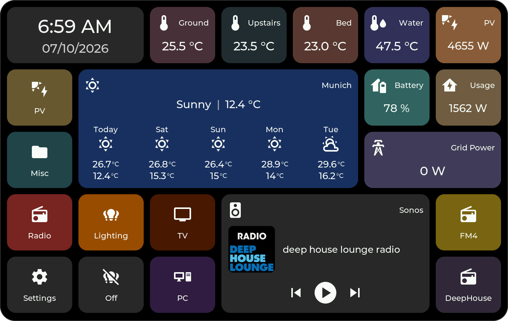

# HomeTiles

Tile-based firmware that turns ESP32-P4 touch displays into Home Assistant control
panels, with an additional experimental ESP32-S3 image — configured entirely in
the browser, updated over the air, connected via MQTT.

  

  
  

## Demo

<video class="ht-demo" controls playsinline preload="metadata" poster="images/hometiles-demo-poster.jpg" aria-label="HomeTiles device demo">
  <source src="videos/hometiles-demo.mp4" type="video/mp4">
</video>

## New Here? Four Steps

1.  **Flash the firmware**

    Download the prebuilt binaries for your device and flash them once over
    USB — every update after that installs over the air.

    [Flashing the Firmware :octicons-arrow-right-24:](flashing.md)

2.  **Connect everything**

    Set up the MQTT broker, install the bridge integration, and pair the
    display with Home Assistant.

    [Home Assistant Setup :octicons-arrow-right-24:](home-assistant-setup.md)

3.  **Build your dashboard**

    Open the display's admin panel in your browser: click a cell, pick a tile
    type, done. Drag & drop, folders, everything saves automatically.

    [Web Admin Panel :octicons-arrow-right-24:](web-admin.md)

4.  **Use the display**

    Control lights with a color wheel, check sensor history, energy statistics,
    weather, and media — all in touch popups on the device.

    [On-Device UI :octicons-arrow-right-24:](device-ui.md)

Looking for something specific? [Tile Types](tiles.md) ·
[Local Hardware I/O](hardware-io.md) · [Screensaver](screensaver.md) ·
[Firmware Updates](updating.md) ·
[FAQ & Troubleshooting](faq.md) ·
[GitHub](https://github.com/GalusPeres/HomeTiles)

## New In v0.6.4

HomeTiles v0.6.4 keeps folders, Weather popups, light controls, Camera sessions,
and the web admin responsive during long sessions. It adds separate screensaver
brightness and a local I/O page for Switch outputs, onboard relays, and
DS18B20 temperature inputs.

Local assignments work directly on the panel. **HomeTiles Bridge v0.6.32 or
newer** also exposes them as `switch` and `sensor` entities on the matching Home
Assistant device. Camera support and the ESP32-S3 build remain experimental.

[Read the v0.6.4 release notes :octicons-arrow-right-24:](releases/v0.6.4.md)

## Device Support

{ width="100%" .ht-hero }

### Hardware-confirmed

| Device | Display | Status |
| --- | --- | --- |
| [M5Stack Tab5](https://shop.m5stack.com/products/m5stack-tab5-iot-development-kit-esp32-p4) | 5" 1280×720 | Supported |
| [Waveshare ESP32-P4-WIFI6-Touch-LCD-4B](https://www.waveshare.com/esp32-p4-wifi6-touch-lcd-4b.htm) | 4" 720×720 | Supported |
| [Waveshare ESP32-P4-86-Panel-ETH-2RO](https://www.waveshare.com/wiki/ESP32-P4-WIFI6-Touch-LCD-4B) | 4" 720×720 | Supported, native Ethernet; uses the 4B firmware |
| [Waveshare ESP32-P4-WIFI6-Touch-LCD-8](https://www.waveshare.com/esp32-p4-wifi6-touch-lcd-7-8-10.1.htm) | 8" 1280×800 | Supported |
| [Guition JC8012P4A1C_I_W_Y](https://www.guition.com/esp32p4-display-module/hmi-display-panel) | 10.1" 1280×800 | Supported |

### Experimental / community-testing builds

| Exact device | Display | Test status |
| --- | --- | --- |
| [Waveshare ESP32-P4-WIFI6-Touch-LCD-7](https://www.waveshare.com/esp32-p4-wifi6-touch-lcd-7-8-10.1.htm) | 7" 1280×720 | [Testing requested in #7](https://github.com/GalusPeres/HomeTiles/issues/7) |
| [Waveshare ESP32-P4-WIFI6-Touch-LCD-10.1](https://www.waveshare.com/esp32-p4-wifi6-touch-lcd-7-8-10.1.htm) | 10.1" 1280×800 | [Testing requested in #7](https://github.com/GalusPeres/HomeTiles/issues/7) |
| [Guition JC1060P470C_I_W_Y](https://www.guition.com/esp32p4-display-module/7-inch-esp32p4-display-module) | 7" 1024×600 | `_I_W_Y` only; [testing requested in #8](https://github.com/GalusPeres/HomeTiles/issues/8) |
| [Guition ESP32-4848S040C_I](https://www.guition.com/esp32-display-module/4-inch-esp32s3-display-module) | 4" 480×480 | ESP32-S3, no camera tile; [initial testing positive, long-duration and OTA coverage pending in #9](https://github.com/GalusPeres/HomeTiles/issues/9) |

Every release provides factory and OTA images for all eight build targets.
Experimental means the image compiles and is published for community testing,
not that the complete device has already passed real-hardware validation.

## How It Works

  Display
  ←&thinsp;MQTT&thinsp;→
  MQTT Broker
  ←&thinsp;MQTT&thinsp;→
  Bridge Integration<small>Home Assistant</small>

The display never talks to Home Assistant directly. The
[bridge integration](bridge.md) pushes entity states, icons, weather, history,
and energy data over MQTT — and executes the commands the display sends back.
Firmware and bridge are MIT-licensed and developed together.
