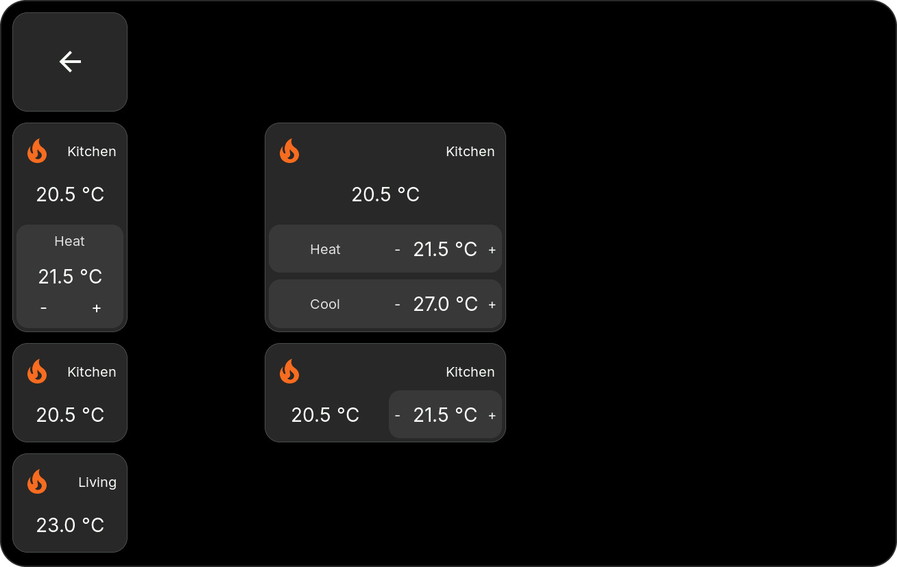
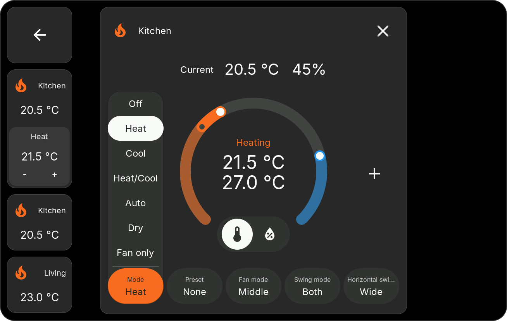
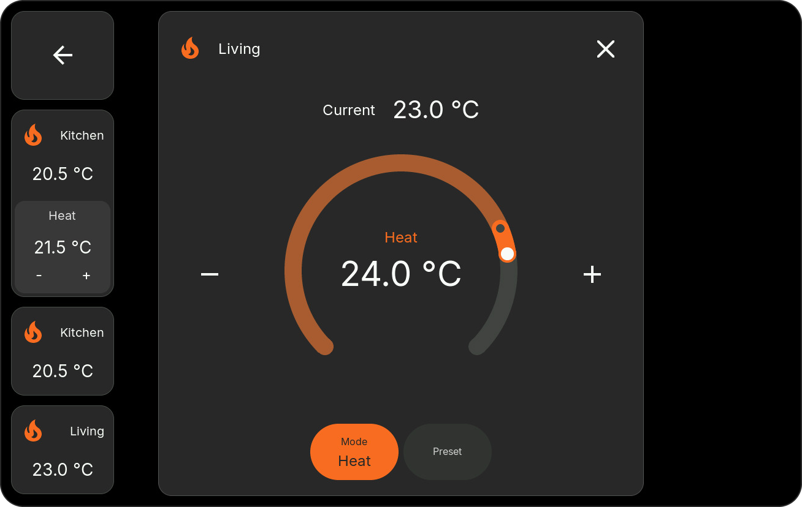

# HomeTiles v0.6.0

HomeTiles v0.6.0 introduces a complete Climate tile and popup system, improves
network transport reliability, and polishes the web editor and on-device UI
across every supported display.

## Configurable Climate Tiles { data-toc-label="Climate tiles" }

- Climate tiles now contain a configurable grid of mini-tiles.
- Mini-tiles can show current temperature, current humidity, target temperature,
  separate heating and cooling targets, target humidity, or HVAC mode.
- Mini-tiles can be selected, moved, removed, and rearranged directly in the web
  preview.
- Resizing a Climate tile updates its slot grid and layout live.
- Automatic content uses the capabilities reported by the Home Assistant entity,
  so unsupported controls stay hidden.
- Empty Climate tiles remain empty until an entity is selected.
- Web previews and the LVGL device renderer use matching geometry, spacing,
  alignment, value formatting, and translated labels.

<figure class="ht-screenshot">

<figcaption>Climate tiles with different mini-tile layouts</figcaption>
</figure>

## Climate Control Popup { data-toc-label="Climate popup" }

The new touch-first popup adapts to each entity and can expose:

- a single target temperature or a low/high target range
- target humidity
- HVAC modes
- presets
- fan modes
- vertical swing modes
- horizontal swing modes

Only supported controls are shown. Long custom option lists are smoothly
touch-scrollable without a visible scrollbar. Current temperature and humidity,
target markers, labels, and the circular control are aligned for both 720p and
800p layouts. Marker colors also update while a target is being dragged.

Rapid plus/minus input is handled without stale state updates causing the value
to jump backwards.

<figure class="ht-screenshot">

<figcaption>Climate popup with all supported controls</figcaption>
</figure>

<figure class="ht-screenshot">

<figcaption>Heat-only Climate popup</figcaption>
</figure>

## Web Editor And Localization { data-toc-label="Editor & languages" }

- Parent tiles and mini-tiles have distinct selection, hover, and drag feedback.
- Dragging a mini-tile no longer selects or moves its parent.
- Parent resize previews keep mini-tile geometry stable in every direction.
- Climate labels use the shared localization profile instead of language-specific
  JavaScript branches.
- German and English captions remain consistent between settings, web previews,
  and the device UI.

## Network And Stability

- Added a shared network transport layer with improved WiFi/Ethernet takeover and
  fallback behavior.
- Improved UI responsiveness while network transports reconnect.
- Hardened ESP-Hosted SDIO transmit and receive allocation paths used by the
  ESP32-P4/ESP32-C6 connection.
- Existing crash diagnostics and safe recovery remain available through the web
  admin.

## Supported Devices

Every release includes OTA and factory binaries for:

- M5Stack Tab5
- Waveshare ESP32-P4-WIFI6-Touch-LCD-4B
- Waveshare ESP32-P4-WIFI6-Touch-LCD-8

Use the plain `.bin` for an OTA update and the `_factory.bin` only for the first
USB flash. See [Firmware Updates](../updating.md) for the complete instructions.
