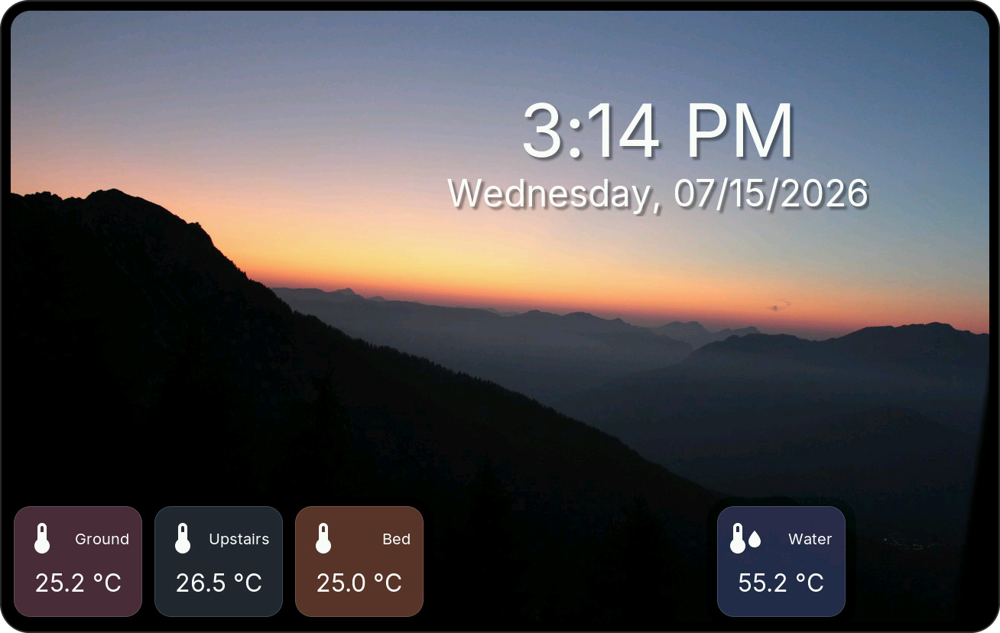
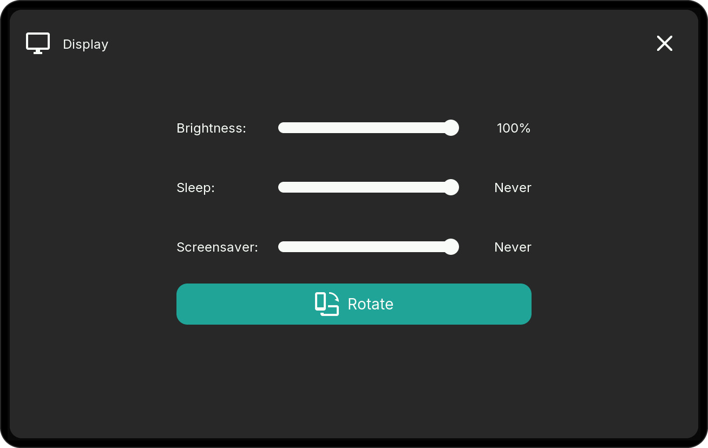
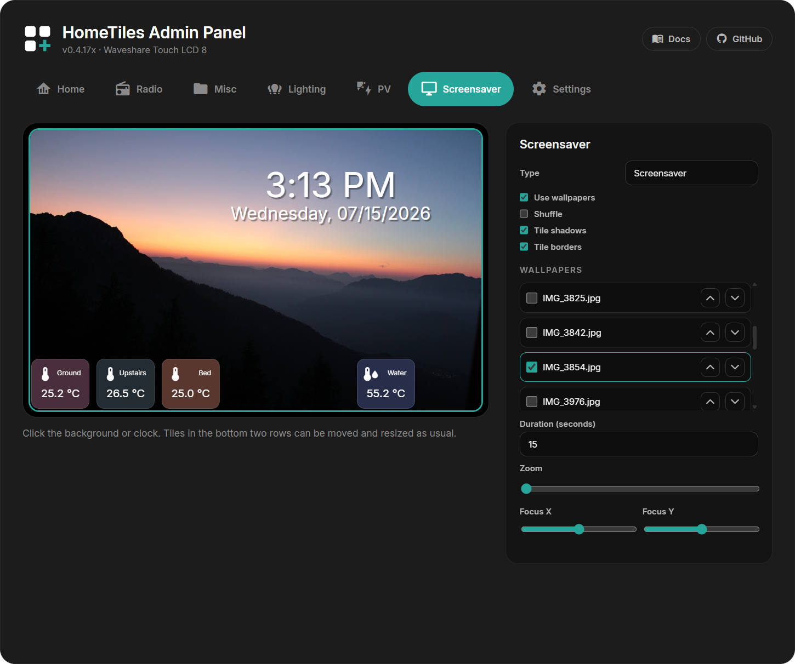

# Screensaver

Create a separate layout with a clock, tiles, and an optional image slideshow in the Web Admin's **Screensaver** tab.

<figure class="ht-screenshot">

<figcaption>Screensaver with clock and sensor tiles</figcaption>
</figure>

## Open It Manually or Automatically { data-toc-label="Start screensaver" }

- Tap a **Clock** tile to open it immediately.
- Set an inactivity timeout under **Settings → Display → Screensaver**. **Never** disables automatic activation.
- Use **Saver bright.** for separate screensaver brightness; the display previews the level while you drag.
- Tap free background space to return to the dashboard.

<figure class="ht-screenshot">

<figcaption>Display and screensaver settings</figcaption>
</figure>

## Prepare the microSD Card { data-toc-label="Prepare images" }

A slideshow needs microSD support. The Waveshare S3 LCD-4 Rev 4.0 and S3 LCD-4B profiles cannot use SD images. The clock and tiles work on a black background without a card.

1. Format the card as FAT32 and insert it.
2. Create an `images` folder in the card's root (`/images`).
3. Copy your JPEGs there, or upload them with the Web Admin file manager.
4. Reload the **Screensaver** tab to update the image list.

### Image Requirements { data-toc-label="Image format" }

- Export **baseline (non-progressive) JPEG**, with a `.jpg` or `.jpeg` extension.
- Use **RGB/sRGB**, not CMYK.
- Resize to your display's resolution in the [device list](index.md#device-support). For a shared image set, keep the **longest edge at 1920 pixels or less**.
- Use quality 80–90 and keep each file below **8 MB**.

If an image stays black, re-export it at the display's native size with these settings. A large camera photo or progressive JPEG may fail even if the filename ends in `.jpg`.

## Configure the Slideshow { data-toc-label="Slideshow settings" }

In the Web Admin's **Screensaver** tab, click the background.

<figure class="ht-screenshot">

<figcaption>Screensaver editor</figcaption>
</figure>

| Setting | What it does |
| --- | --- |
| **Use images** | Enable the slideshow instead of a black background |
| **Shuffle** | Choose images randomly |
| **Tile shadows / Tile borders** | Style the overlay tiles |
| **Image checkboxes** | Include or exclude files |
| **Arrow buttons** | Change the image order |
| **Duration** | Display time for every image |
| **Zoom** | Enlarge the selected image |
| **Focus X / Focus Y** | Move its crop horizontally or vertically |

Changes save automatically.

## Position the Clock

Select the clock to change its time/date formats, font sizes, alignment, and shadow. Drag it anywhere and resize its text area; it is independent of the tile grid.

## Add Tiles

The bottom two rows support Sensor, Binary Sensor, Energy, Switch, Scene, and Media tiles. Select a slot, choose its type, and move or resize it as on the dashboard. Adjust **Color** and **Opacity** together.

States stay live. Popups do not open in screensaver mode. Local I/O switches and temperatures remain available when Home Assistant is offline.

Media tiles need at least 2×2 cells. Cover art can slow entry and slide changes; use fewer Media tiles if the slideshow feels slow.

## Backup and Restore

[Web Admin Export](web-admin.md#import-export) includes the screensaver layout and settings. Image files stay on the microSD card and must be copied separately.
