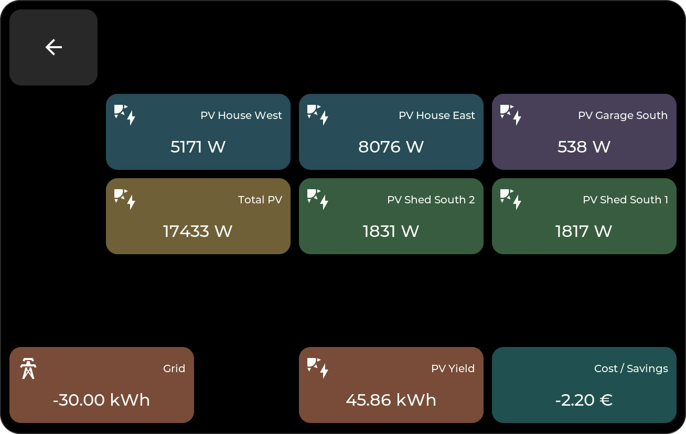

# Tile Types

Create and configure tiles in the [Web Admin](web-admin.md#creating-a-tile). Select Home Assistant entities in the [Bridge options](bridge.md#entity-configuration) first.

**Home Assistant tiles** show entity data or control your devices. **Local tiles** provide clocks, text, folders, animations, and spacing.

All tiles share title, icon, color, size, and position settings. For types with a popup, choose whether a tap or long press opens it. See [on-device controls](device-ui.md#popups) for screenshots.

Press **Enter** in the title field for a second line. The two lines share the same vertical center as a single-line title; text that does not fit ends in `...`. The display, popup header, and Web Admin preview use the same title. Number, Select, and Date/Time tiles also offer the same five value-size choices as Sensor tiles.

## Home Assistant Tiles

### Sensor

Shows a numeric or text-valued `sensor.*` entity. Configure the unit, decimals, value size, and an optional gauge with a minimum and maximum.

**Popup:** 24-hour or 7-day history as a graph for numbers, or a timeline and Activity list for text states.

A local [DS18B20 input](hardware-io.md) can also supply the value without Home Assistant; local inputs have no Home Assistant history popup.

### Binary Sensor

Shows a `binary_sensor.*` entity with the matching state and icon, such as Open/Closed or Motion/Clear. Unknown and unavailable states are shown separately.

**Popup:** a 24-hour or 7-day state timeline and Activity list.

### Number

Changes a `number.*` or `input_number.*` entity. The tile shows its current value and unit; the popup uses the minimum, maximum, step, and input mode supplied by Home Assistant.

- Slider values use a centered slider with the value above it. Release the slider to send the final value.
- Temperatures use **− / value / +**, like the Climate target control.
- Other box-mode values use a bounded roller or step buttons, depending on their range.

**Popup:** numeric history graph and Activity for **24H** or **7D**. History requires the entity to be recorded by Home Assistant.

### Select

Changes a `select.*` or `input_select.*` entity using its current Home Assistant options. The tile shows the selected value; the popup uses the same dropdown interaction as Settings.

**Popup:** state timeline and Activity for **24H** or **7D**. An unavailable entity or incomplete option list disables selection. To operate another display's view, select that display's [View entity](bridge.md#control-the-displayed-view) in the Bridge first.

### Date/Time

Changes `time.*`, `date.*`, `datetime.*`, or `input_datetime.*` entities. Available controls follow whether the entity contains a time, a date, or both.

Time uses a single visible row of large, swipeable **hh / mm / ss** values, with wraparound between 23 and 00 or 59 and 00. Date fields use step controls without a keyboard. Changes to rollers and step controls are sent after a short pause, so you can finish editing before a slow device responds.

**Popup:** Activity for **24H** or **7D**. Home Assistant's time zone is used for date/time commands.

These three editable types need HomeTiles **v0.6.10** and Bridge **v0.6.44 or newer**. Add them in [Bridge Entity Configuration](bridge.md#entity-configuration), then choose their entity, value size, and popup trigger in the Web Admin. Their control surfaces follow the popup color while keeping white text readable. Delayed state updates do not immediately overwrite an edit; unavailable entities cannot be changed.

### Energy

Shows Home Assistant **Energy Dashboard** statistics for electricity, gas, water, or cost. Enable the matching [Bridge energy category](bridge.md#energy-dashboard).

Configure the energy entity, unit, decimals, and value size. In this example, Sensor tiles show current power at the top; Energy tiles show today's totals at the bottom.

<figure class="ht-screenshot">

<figcaption>Solar dashboard with sensor and energy tiles</figcaption>
</figure>

**Popup:** hourly bars for the day and daily bars for the week.

### Switch

Toggles a compatible entity and reflects its state. Choose the entity, tile style, and popup trigger.

| Home Assistant domain | Tile action |
| --- | --- |
| `switch`, `light` | Turn on/off |
| `input_boolean` | Set a Toggle helper on/off |
| `automation` | Enable/disable the automation's triggers |
| `fan`, `humidifier`, `remote`, `siren` | Turn the entity on/off using its configured defaults |

The additional domains require Bridge v0.6.42 and the updated firmware. Select them under **Switches / switchable entities** in the Bridge; lights keep their own selector. Fan and Siren controls require both HA on/off feature flags. Missing, unavailable, or unsupported entities cannot be operated.

An [automation switch](https://www.home-assistant.io/docs/automation/services/) enables/disables the automation; it does not run its actions immediately. Turning it off follows HA's default behavior and stops running actions. Advanced fan speed, humidity, remote commands/activities, and siren tones are outside this tile's on/off controls.

Local [outputs and relays](hardware-io.md) appear in the same selector and work without Home Assistant.

**Popup for lights:** supported brightness, color, and color-temperature controls.

**Popup for other compatible entities:** the existing on/off slider in the same popup.

### Cover

Controls a `cover` entity and shows its state and position when available.

**Popup:** supported position and tilt sliders, plus open, close, and stop buttons.

### Scene

Runs a configured action with a tap; there is no popup. Choose the alias generated for it in the [Bridge options](bridge.md#entity-configuration).

| Home Assistant domain | Tile action |
| --- | --- |
| `scene` | Activate the scene (`scene.turn_on`) |
| `script` | Start the script without additional fields (`script.turn_on`) |
| `button` | Press the button once (`button.press`) |
| `input_button` | Press the Button helper once (`input_button.press`) |

Buttons require Bridge v0.6.42 and the updated firmware. A never-pressed button remains usable even when HA reports an unknown timestamp. Missing or unavailable actions are ignored. Existing aliases remain stable when you reorder the selection or add entities with the same object name; custom aliases remain supported.

Use an HA script with defaults when an action needs parameters. Read-only `binary_sensor` and `event` entities cannot be pressed or switched. Locks, alarms, vacuums, valves, and update entities have different actions and are not mapped to these tile types; Cover, Climate, and Media keep their dedicated tiles.

### Weather

Shows current conditions from a `weather` entity.

**Popup:** temperatures, precipitation, and rain probability for the available forecast.

### Media

Shows cover art, title, and playback controls for a `media_player` entity.

**Popup:** playback controls and volume.

### Climate

Controls a `climate` entity. The icon and accent indicate active heating, cooling, drying, or fan operation.

Configure mini-tiles for temperatures, humidity, targets, and mode, or choose **Automatic**. Arrange them in the [Climate mini-tile editor](web-admin.md#editing-climate-mini-tiles).

<figure class="ht-screenshot">

<figcaption>Climate tiles with different mini-tile layouts</figcaption>
</figure>

**Popup:** temperature controls and supported modes, presets, fan, swing, and humidity settings. Heating/cooling ranges have separate targets.

### Camera (experimental) { data-toc-label="Camera" }

Opens a 16:9 video popup on ESP32-P4. Select the camera in the Bridge's **Entity Configuration**, then assign it to this tile.

Allow local TCP access to the Home Assistant host on ports `8124`–`8131`. See [Camera connection](bridge.md#experimental-camera-transport) for requirements and performance notes. Camera tiles are unavailable on ESP32-S3.

## Local Tiles

These types work without Home Assistant.

### Clock

Shows time and date using the device's localization settings. You can override the formats and sizes for each tile. Tap it to open the [screensaver](screensaver.md).

### Text

A static label with a selectable font size.

### Folder

Opens a sub-page with its own grid and an automatic back tile. See [Folders](web-admin.md#folders) for setup and optional PIN protection.

### Animation

Plays a `.panim` pixel animation from `/animations` on microSD. Configure frame rate, fit, and zoom.

### Empty

Leaves an empty cell for spacing.
