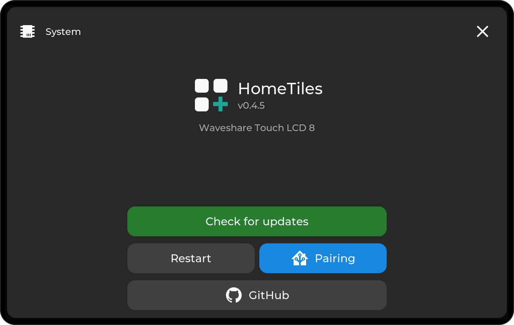
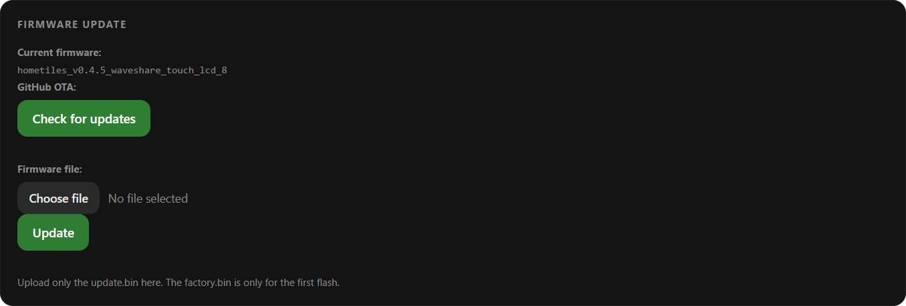

# Firmware Updates

Normal updates keep your Wi-Fi, MQTT settings and dashboard. Keep the display powered until installation finishes, then check the version under **Settings → System**.

## On-device updater { #1-on-device-updater-recommended }

Open **Settings → System**, tap **Check for updates**, and install the offered version. The display restarts when finished; Web Admin and MQTT reconnect automatically.

<figure class="ht-screenshot">

<figcaption>System information and firmware update</figcaption>
</figure>

## Web Admin upload { #2-web-admin-ota-upload }

Use this method for a local test build or when downloading directly on the display fails.

1. Download the exact model's plain **`.bin`** from the [release page](https://github.com/GalusPeres/HomeTiles/releases). Do **not** select `_factory.bin`.
2. Open `http://<display-ip>/` and find **Firmware**.
3. Choose the file and start the upload. The screen may go black during installation; wait for the display to restart.

<figure class="ht-screenshot">

<figcaption>Firmware update in the Web Admin</figcaption>
</figure>

Check exact model, revision and known limitations in the [device list](index.md#device-support). The Web Admin can also run the same release check as the display.

## USB update { #3-browser-installer-over-usb }

If the display is unreachable over the network, open the [online flasher](installer.md#browser-installer) and choose **Update**. It preserves local settings and writes only to the inactive application slot.

For a new device or an intentional full reset, use **First install / factory reset** there instead. This erases all local data.

## If an update fails { #troubleshooting-esp32-p4c6-github-downloads }

Restart the display and retry once. If a direct GitHub download still fails, use the **Web Admin upload** above. The updater may restart more than once during recovery; check the installed version afterwards. An interrupted normal update leaves the previously selected application bootable.

If it still fails, [download the diagnostics and report the problem](faq.md#the-display-crashed-or-restarted-by-itself). For the Guition JC8012 V1 Camera/Web OTA fix, see its note in the [device list](index.md#device-support).

To build your own firmware, follow [CONTRIBUTING.md](https://github.com/GalusPeres/HomeTiles/blob/main/CONTRIBUTING.md).
