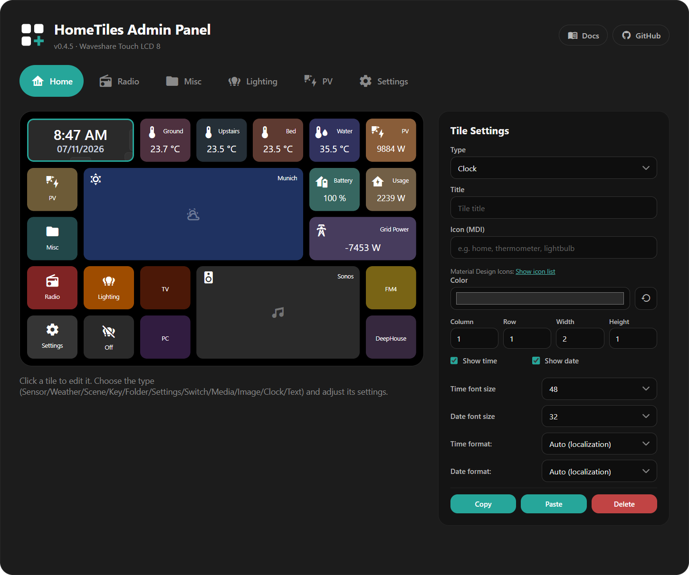
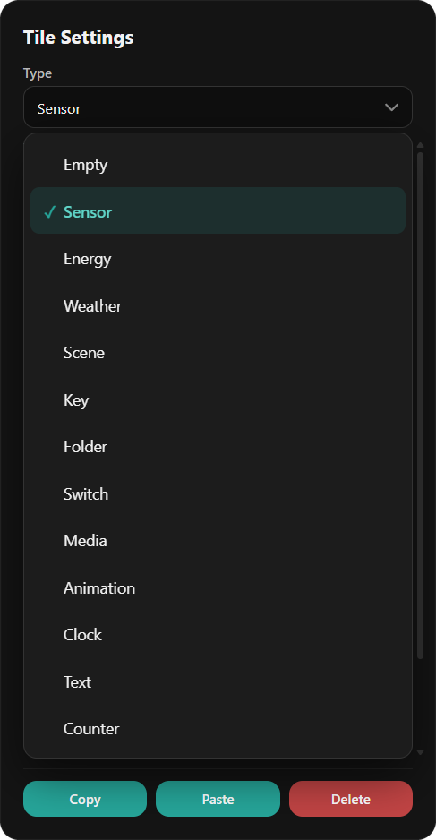
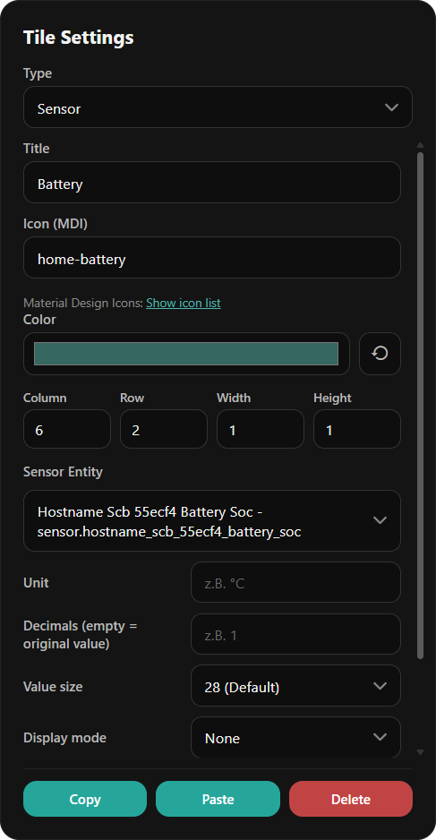
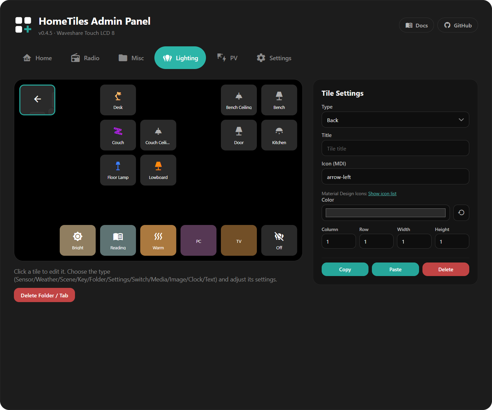
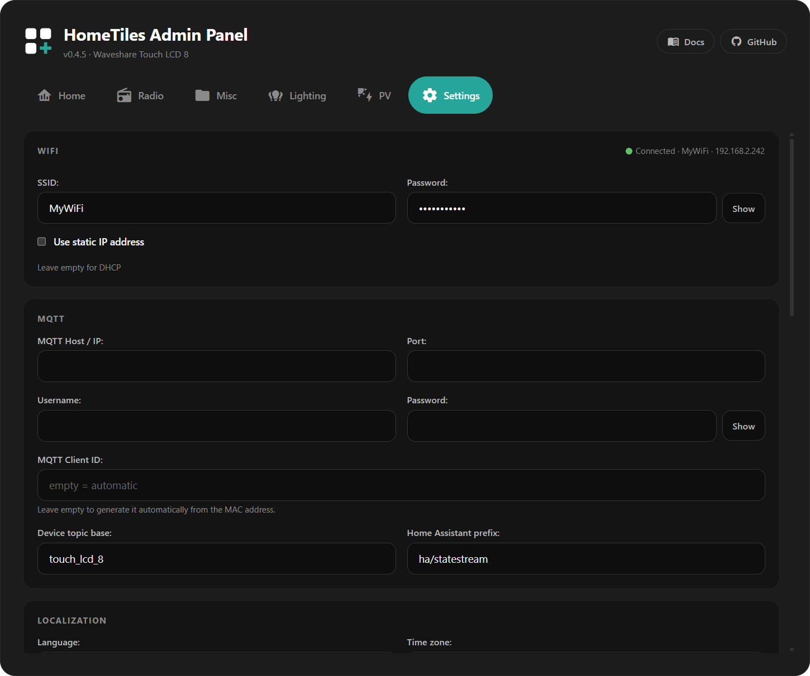
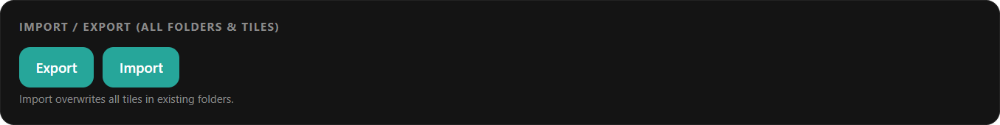

# Web Admin Panel

Open `http://<display-ip>/` to edit your dashboard. Find the IP under **Settings → WiFi** on the display or on its Home Assistant device page.

<figure class="ht-screenshot">

<figcaption>Web Admin dashboard editor</figcaption>
</figure>

Select a tile in the grid preview to open its settings. Each folder has its own tab.

!!! tip "Changes save automatically"
    Tile edits save as you make them and appear on the display.

## Creating a Tile

1. Click an empty cell.
2. Choose a **Type**.
3. Select an entity where needed and adjust the tile.

Every tile has these settings:

- **Title:** optional label; press **Enter** for a second line. Both lines are centered together, and each line ends in `...` if it exceeds the available width. The display, popup header, and live preview follow the tile's size.
- **Icon (MDI):** a [Material Design Icon](https://pictogrammers.com/library/mdi/) name. **Show icon list** opens the catalog.
- **Color:** background color; Reset restores the type's default.
- **Column, Row, Width, Height:** grid position and size.

See [Tile Types](tiles.md) to choose the right type.

<figure class="ht-screenshot ht-editor-detail">

<figcaption>Choose a tile type in the Web Admin</figcaption>
</figure>

### Type-specific settings { data-toc-label="Type settings" }

Fields depend on the selected type. A numeric Sensor offers:

| Field | Purpose |
| --- | --- |
| Entity | Sensor to display |
| Unit | Unit label, such as °C or W |
| Decimals | Decimal places |
| Value size | Size of the displayed value |
| Display mode | Text or a gauge with a minimum and maximum |

Number, Select, and Date/Time also offer **Value size** with the same five choices as Sensor. Their live values appear in the preview, including after switching folders or selecting another tile. Choose the matching entity and whether a tap or long press opens its popup.

<figure class="ht-screenshot ht-editor-detail">

<figcaption>Sensor tile settings</figcaption>
</figure>

### Editing Climate Mini-Tiles { data-toc-label="Climate mini-tiles" }

Click a Climate mini-tile in the preview to edit it, or drag it to another slot. The outline shows whether you are selecting the parent tile or a mini-tile.

Choose temperature, humidity, targets, or mode. **Automatic** chooses values supported by the entity. Resizing the parent changes the available slots and keeps placed mini-tiles where they still fit.

<figure class="ht-screenshot">

<figcaption>Climate tile and mini-tile editor</figcaption>
</figure>

## Moving, Resizing, Copying { data-toc-label="Move, resize, copy" }

- **Move:** drag a tile to another cell.
- **Resize:** drag its edge handles or enter **Width / Height**.
- **Copy / Paste:** duplicate a tile, including between folders.
- **Delete:** clear a tile back to an empty cell.

## Folders

Choose the **Folder** type to create a sub-page. It appears as a Web Admin tab and includes a back tile.

<figure class="ht-screenshot">

<figcaption>Folder editor with back tile</figcaption>
</figure>

**Delete Folder / Tab** removes the folder and its tiles. You can change the back tile's icon and color.

To protect a folder, select its tile, enable **Protect this folder with a PIN**, enter 4–8 digits, and press **Apply PIN**. Folder PINs are stored only on that display and are excluded from exports.

## Screensaver Editor

Open the **Screensaver** tab. Select the background, clock, or a tile to edit it; drag to move and resize.

See the [Screensaver guide](screensaver.md) for images, activation, and available tiles. Its **Tile borders** setting is independent of **Settings → Display → Subtle tile borders** for the normal dashboard.

## Device Settings

The **Settings** tab contains:

- **Network:** WiFi credentials, connection type on Ethernet-capable devices, and an optional static IP shared by WiFi and Ethernet.
- **MQTT:** broker address, credentials, and topics; normally supplied by [pairing](home-assistant-setup.md).
- **Localization:** language, time zone, and date/time formats.
- **Access control:** protect Settings with a 4–8 digit PIN, hide its Home tile, and choose the edge gesture that reveals it.

If Settings is hidden, swipe inward from the chosen edge. Restoring its tile requires a free 1×1 Home cell.

The public recovery PIN **466384537** unlocks Settings and folders. This is a local child lock; the Web Admin has no login protection. PINs are excluded from dashboard exports.

<figure class="ht-screenshot">

<figcaption>Device settings in the Web Admin</figcaption>
</figure>

Use **Save** for the settings form. **Restart** is a separate action.

## Local Hardware I/O

Open **I/O** to configure outputs, relays, or DS18B20 sensors. Only pins available for the selected device are offered. See [Local Hardware I/O](hardware-io.md) for setup and wiring.

## Import / Export

**Export** saves folders, tiles, and the screensaver layout in one JSON file. It excludes local I/O assignments and PINs. Older files without screensaver data leave the current screensaver unchanged.

<figure class="ht-screenshot">

<figcaption>Import and export settings</figcaption>
</figure>

!!! warning
    Import replaces the folders, tiles, and screensaver data contained in the file.

## Screenshot & Diagnostics { data-toc-label="Diagnostics" }

- **Create & Download Screenshot:** saves and downloads a JPEG of the current screen; requires microSD.
- **Download crash log:** downloads reset reasons and crash details.
- **Core dump:** download or delete a stored memory snapshot when one is available.

See [Reporting a crash](faq.md#the-display-crashed-or-restarted-by-itself) for the files and details to include.

## Firmware Update

Check for releases or upload the matching OTA `.bin` in the Firmware section. Follow [Firmware Updates](updating.md) for the steps.

## File Manager

With a FAT32 microSD card inserted, use the file manager to upload, download, rename, or delete files and create folders. A card is optional for normal dashboard use.
