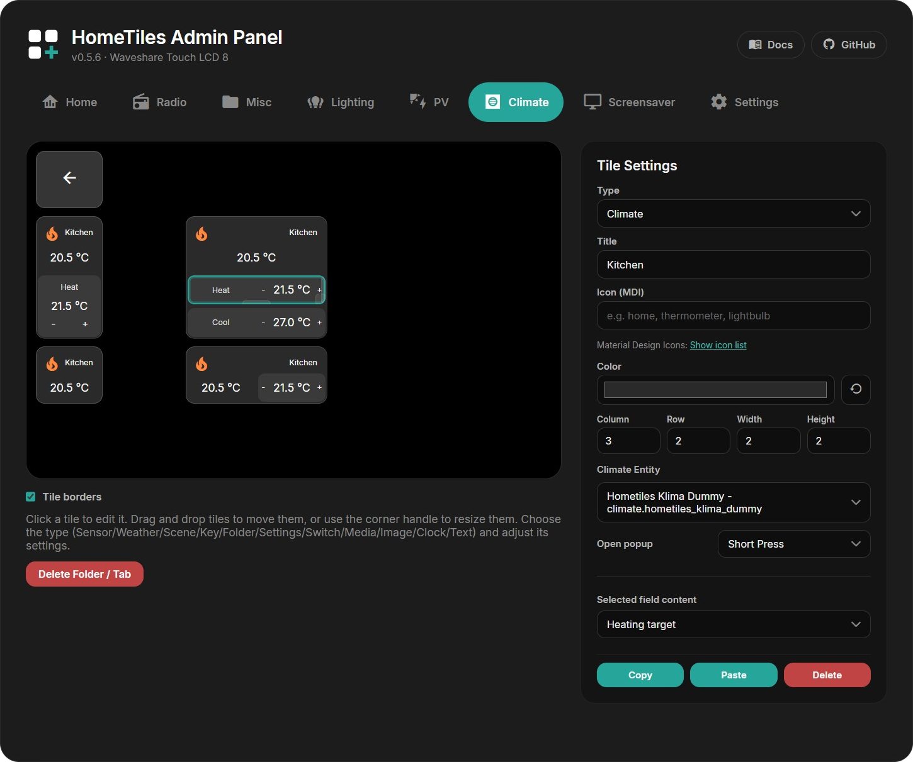

# Web Admin Panel

Every device runs its own admin panel — the whole dashboard is configured in the
browser, nothing on the device itself. Open `http://<display-ip>/` (the IP is shown
on the device under **Settings → WiFi**, and in Home Assistant on the device page).

The layout mirrors the device: on the left a live preview of the tile grid with one
tab per folder, on the right the **Tile Settings** panel for the selected tile.

!!! tip "Changes save automatically"
    There is no save button for tiles. Every edit — title, color, position, type —
    is applied and stored as you make it, and the display updates within a second or two.

## Creating a Tile

1. **Click any empty cell** in the grid. The Tile Settings panel opens for it.
2. Pick a **Type** — the cell immediately becomes that tile.
3. Fill in the fields for that type (they change with the type — a Sensor tile asks
   for an entity, a Clock tile for time/date formats, and so on).

{ width="360" }

Every tile shares the same base settings:

| Setting | What it does |
| --- | --- |
| **Title** | Label shown on the tile (optional) |
| **Icon (MDI)** | Any [Material Design Icon](https://pictogrammers.com/library/mdi/) by name, e.g. `thermometer` — the *Show icon list* link opens the catalog |
| **Color** | Tile background; the reset arrow returns to the type's default |
| **Column / Row / Width / Height** | Position and size on the grid |

Below that come the type-specific fields. For a Sensor tile, for example: the
Home Assistant entity, unit, decimals, value size, and an optional gauge display mode.

{ width="360" }

An overview of all tile types and what each one needs is on the
[Tile Types](tiles.md) page.

### Editing Climate Mini-Tiles

A Climate tile contains its own slot grid. Click a mini-tile directly in the
preview to edit its content, or drag it to another slot. Empty slots remain
selectable, and dashed hover outlines show whether the next click or drag targets
the parent tile or a mini-tile.

Available content includes current temperature, current humidity, target
temperature, separate heating and cooling targets, target humidity, and mode.
**Automatic** picks content supported by the selected entity. The web admin does
not invent unavailable controls, and its preview uses the same layout rules as
the on-device renderer.

When the parent tile is resized, the slot grid adapts immediately and shows the
new layout during the drag. Explicitly placed mini-tiles are preserved wherever
they still fit.

{ width="80%" }

## Moving, Resizing, Copying

- **Move** — drag a tile to another cell; a placeholder shows where it will land.
- **Resize** — drag the handles on the tile's right/bottom edge, or type exact
  values into *Width* / *Height*.
- **Copy / Paste** — copy a configured tile and paste it onto another cell (also
  across folders). **Delete** clears the tile back to an empty cell.

## Folders

Set a tile's type to **Folder** and a sub-page is created automatically: it appears
as a new tab in the admin panel, and on the device the tile opens that page — with
a back tile placed in the top-left corner for you.

The folder tab has a **Delete Folder / Tab** button that removes the sub-page and
all tiles on it. The back tile can be restyled (icon, color) but keeps its function.

Each Folder tile can also have its own 4–8 digit PIN. Select the Folder tile,
enable **Protect this folder with a PIN**, enter a new PIN, and press **Apply
PIN**. Folder PINs stay on that display and are deliberately excluded from
dashboard exports.

## Screensaver Editor

The dedicated **Screensaver** tab is a live preview of the separate screensaver
layout. Click the background to configure the slideshow, click the clock to change
its content and alignment, or select one of the slots in the bottom two rows to
configure a tile. The clock can be moved and resized freely; screensaver tiles use
the same drag, resize, copy, paste, color, and opacity controls as the normal grid.

The editor requires JPEG images in `/images` on a microSD card. The complete setup,
all slideshow options, automatic activation, and media-tile performance notes are
documented in the [Screensaver guide](screensaver.md).

The **Settings → Display** section also contains a global **Subtle tile borders**
option. It applies to every tile on the normal dashboard and its web previews.
The screensaver keeps its own independent **Tile borders** option.

## Device Settings

The **Settings** tab configures the device itself — the same options as in the
on-device settings, plus a few admin-only ones:

- **Network** — connection status, WiFi credentials, and one optional static
  IP profile shared by WiFi and Ethernet. Ethernet-capable builds also let you
  choose which connection type is used after restart
- **MQTT** — broker host, port, credentials, topic base. Normally filled
  automatically by [pairing](home-assistant-setup.md); only touch this for a
  manual setup
- **Localization** — language, time zone, time and date format
- **Access control** — protect Settings with a 4–8 digit PIN, optionally hide
  its Home tile, and choose the screen edge used to reveal it

When the Settings tile is hidden, swipe inward from the configured edge to open
the PIN popup. Showing the tile again needs one free 1×1 cell in Home; otherwise
the save is rejected without changing the current lock settings.

The documented recovery PIN is **466384537**. It unlocks Settings and protected
folders if a user PIN is forgotten. This is a local child lock, not a login:
the recovery PIN is public and the Web Admin itself has no user authentication.
PINs and their protection metadata remain device-local and are not included in
dashboard exports.

Unlike tile edits, this form uses the green **Save** button in the footer —
next to it is the device restart button.

## Local Hardware I/O

The **I/O** tab assigns only the profile-whitelisted pins exposed by the
current firmware target. Select **+ Switch** for an output or **+ Temperature**
for a DS18B20 input. Each compact row shows the name, resulting local entity ID,
GPIO, and the controls supported by that channel.

I/O assignments use separate **Save** and **Restart** buttons. A
normal Save applies the new runtime configuration immediately and refreshes the
entity selectors used by normal and screensaver tiles. Restart does not save
pending edits; it only reboots the panel so the configured startup state can be
checked.

Local Switch tiles control their output directly without an MQTT round trip.
HomeTiles Bridge v0.6.32 or newer additionally creates matching Home Assistant
`switch` and `sensor` entities on the panel device.

See [Local Hardware I/O](hardware-io.md) for supported pins, onboard relay
behavior, DS18B20 wiring, and electrical safety notes.

## Import / Export

Exports the complete dashboard — all folders, tiles, and the screensaver layout —
as a single JSON file; import restores it. Useful as a backup before bigger layout
changes, or to copy a layout to a second device. Older exports without a screensaver
section remain supported and leave the current screensaver configuration unchanged.
Local Hardware I/O assignments are deliberately device-specific and are not
included in this dashboard file.

!!! warning
    Import overwrites the folders, tiles, and screensaver data contained in the file.

## Screenshot & Diagnostics

**Create & Download Screenshot** saves a JPEG of the current screen to the microSD
card and downloads it in the browser (requires a card).

**Download crash log** fetches `crashlog.txt`: whenever the display crashes or
restarts unexpectedly, the firmware appends the reset reason and a crash summary
(crashed task, program counter, registers) to this file on the next boot. If no
crash has ever been recorded, the button just says so.

After a crash the firmware also keeps a **core dump** — a full snapshot of the
crash — in a dedicated flash partition. When one is stored, the section shows a
summary line plus buttons to download or delete it.

Found a crash? Please [report it](faq.md#the-display-crashed-or-restarted-by-itself) —
the crash log and core dump are exactly what's needed to fix it.

## Firmware Update

The Firmware section checks GitHub for new releases and installs them, or takes a
manually uploaded `update.bin`. Details on all update paths are on the
[Firmware Updates](updating.md) page.

## File Manager

If a microSD card (FAT32) is inserted, a file manager section appears: upload one
or several selected files, download, rename, delete, and create folders. The card
is optional for the normal dashboard, but required for screenshot export and
screensaver images.
